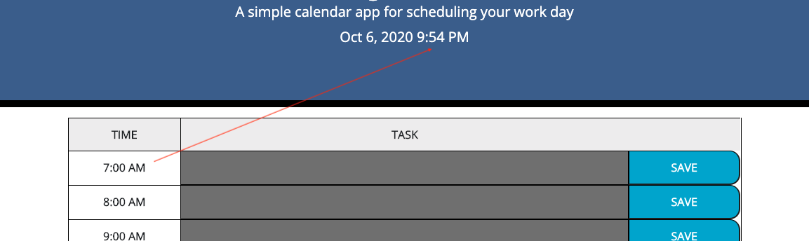
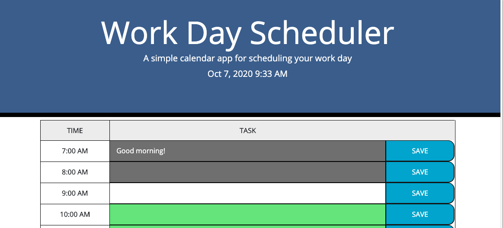
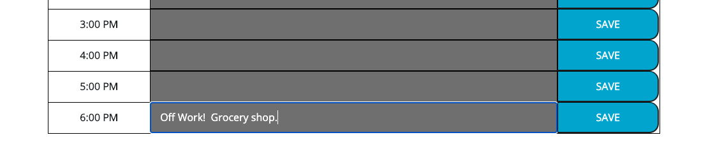
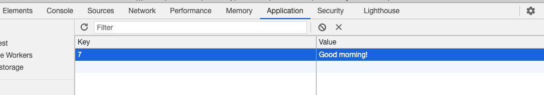

# Work.Day.Scheduler

[](https://opensource.org/licenses/MIT)
      
     
## Description

The purpose of this exercise was to construct a workday planner that evaluated the current time, using moment.js, and colored coded each time-block with a past, current or future color scheme.  Past time-block is indicated as gray, current time indicated as white, future time-block indicated in green.  User input will remain after save button and page is refreshed.  Technologies used: HTML, CSS, JavaScript, Moment.js, Bootstrap and Google Fonts.

## Table of Contents
 
* [Installation](#installation)
* [Usage](#usage)
* [Credits](#credits)
* [License](#license)
 
## Installation
```
No install required.
``` 

## Usage
Access Work.Day.Scheduler[here.](https://lee-amber-alex.github.io/Work.Day.Scheduler/) 
Access the project repository  [here.](https://github.com/lee-amber-alex/Work.Day.Scheduler)  

#### Date and Time:

  

#### Time-block:

  

  

#### Saved tasks:

  

  

## Credits  
Background images obtained from [freepik](http://www.freepik.com).
UW Coding Bootcamp for providing frontend code.

## License
This project is covered under the MIT License.
 

## Questions
- [Email](lee.amber.alex@gmail.com)
- [Github Page](https://github.com/lee-amber-alex)
 
